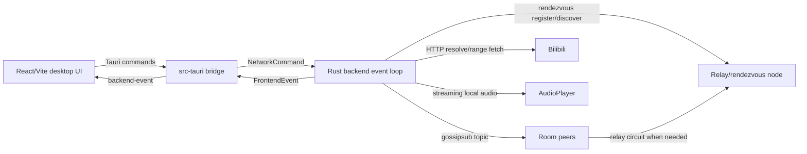

# link-ear architecture

`link-ear` is a P2P chat and shared listening app. Its core goal is not to stream audio between peers, but to synchronize chat history, a shared queue, vote results, and playback state so each client can download audio locally and play it at roughly the same time.

This document describes the current implementation boundaries. Runtime commands and examples live in `README.md`; repeatable real-world checks live in `docs/manual-smoke-test.md`.

## System Shape

The desktop path is the primary product path. The legacy terminal UI has been removed; the root crate now builds the backend library plus the relay/rendezvous binary.

## Runtime Processes

- Client backend: `src/backend.rs`
  - Owns the libp2p `Swarm`, command receiver, UI event sender, history cache, music state, connection state, streaming audio events, and periodic timers.
- Desktop bridge: `src-tauri/src/main.rs`
  - Translates Tauri commands into `NetworkCommand`.
  - Emits backend `FrontendEvent` values to the webview as `backend-event`.
- Desktop UI: `desktop/src/main.jsx`
  - Renders setup, chat, player, queue drawer, vote modal, peer overview, and status log.
  - Does not own protocol truth; it reflects backend events and invokes backend commands.
- Relay/rendezvous server: `src/bin/link-ear-relay.rs`
  - Provides circuit relay and rendezvous server behaviours.
  - Hosts a local topology dashboard for relay-observed state.

## Module Map

- `src/core.rs`
  - Public/shared data model: `WireMessage`, `FrontendEvent`, `NetworkCommand`, queue/playback/vote views, chat records, and small pure helpers.
  - Changes here are often wire/API changes. Keep them deliberate and backward-aware.
- `src/backend.rs`
  - Integration layer. It translates commands, wire messages, and swarm events into state-machine calls, then performs side effects.
  - Side effects include `swarm.dial`, `swarm.close_connection`, publish helpers, UI sends, Bilibili HTTP work scheduling, and audio player calls.
- `src/music_state.rs`
  - Internal pure-ish music state machine for queue, playback phase, pending prepare, playback version, and active vote.
  - This is where most queue/playback/vote rules should be tested.
- `src/buffer_state.rs`
  - Internal buffer quorum coordinator for start, seek, and resume operations.
  - It tracks short-lived operation ids, expected real room peers, local/remote buffer status, quorum readiness, timeout, and impossible quorum.
- `src/media_cache.rs`
  - Range-cache support for long media: byte-range mapping, merge/gap tracking, HTTP Range probing, deterministic cache paths, and cache eviction helpers.
  - Streaming playback uses this module for local Bilibili media cache; unsupported Range is a recoverable media failure.
- `src/connection_state.rs`
  - Internal connection strategy layer for routes, direct addresses, gossipsub warmup, chat subscription readiness, direct promotion backoff, and relay handoff.
  - This module returns effects; `backend.rs` performs the libp2p calls.
- `src/bilibili.rs`
  - Bilibili resolve and signing helpers.
  - Prefer deterministic helper tests for URL/signature/media selection changes.
  - Resolve selects plausible media URLs and does not run decoder probes; decode
    failures converge through streaming prepare.
- `src/player.rs`
  - Local audio output, volume/position control, HTTP Range streaming prepare, background decode, and local cache progress events.
  - Volume is local-only and must not enter shared playback wire state.
  - The default build uses Symphonia native AAC. The opt-in
    `fdk-aac-decoder` feature swaps in the FDK AAC Symphonia adapter for
    broader AAC support.
- `src/playback_health.rs`
  - Internal active-playback buffer-health quorum state for majority-loss pause decisions.

## Backend Event Loop

`run_network` is the external backend entrypoint. It builds the libp2p swarm, sets timers, listens/dials configured addresses, and then handles these inputs in one async loop:

- `NetworkCommand` from the Tauri bridge.
- libp2p `SwarmEvent`.
- periodic history/queue summary sync.
- periodic playback state publication by the playback leader.
- direct promotion retry tick.
- gossipsub warmup / relay handoff tick.
- rendezvous register/discover ticks.
- streaming audio prepare/cache/health events.

The event loop should stay responsive. Bilibili Range fetch and Symphonia decode work run outside the main swarm loop, and stale stream events are ignored by playback session id, buffer operation id, and track id.

## Wire Messages And Source Validation

Room protocol messages are `WireMessage` values serialized as JSON. They flow over the room gossipsub topic only.

`HistoryRequest`, `HistoryResponse`, `QueueRequest`, and `QueueResponse` keep their `target` fields, but they are still broadcast over gossipsub and ignored by non-target peers. If gossipsub reports `NoPeersSubscribedToTopic`, the backend reports a status error and does not attempt direct request-response fallback.

Inbound gossipsub messages use source validation against the authenticated source peer:

- chat/name/history summary/request actors must match the source;
- queue state `updated_by` must match the source;
- playback state/prepare leader must match the source;
- playback ready peer must match the source;
- playback buffer prepare/cancel leader must match the source;
- playback buffer status peer must match the source;
- playback buffer health peer must match the source;
- vote proposer/ballot peer must match the source.

This validation is why deterministic vote application is local-only on most peers: for playback votes, every peer applies the same state locally from the proposal timestamp and proposer identity, but only the peer whose id matches the resulting `leader_peer_id` publishes the playback state.

## Networking Topology

Peers can meet in three ways:

- explicit peer multiaddrs from config;
- mDNS on LAN, unless disabled;
- relay/rendezvous discovery.

The relay address is also treated as a rendezvous node. Clients register under the current room topic, discover other registrations, dial discovered peers, then try to promote relay-only routes to direct routes when usable direct addresses appear.

Important current timings:

- Swarm idle connection timeout: 1 hour on clients and relay server.
- Rendezvous registration TTL: 2 hours.
- Rendezvous refresh interval: 1 hour.
- Rendezvous discovery interval: 30 seconds.
- Gossipsub warmup before direct promotion timeout: 5 seconds.
- Direct promotion retry tiers: 30 seconds, then 2 minutes, then 10 minutes, then suspended after the configured max failures.
- Relay handoff grace after direct connection readiness: 10 seconds.

Rendezvous discovery results for currently disconnected peers are used for the immediate disconnected dial only. They are not cached into the local peer overview. Successful connections and identify events repopulate local connection state. When the last connection to a peer closes, cached direct addresses and backoff state are cleared so the peer overview does not fill with stale `known` peers.

On graceful shutdown, clients attempt to unregister from connected rendezvous nodes before the backend exits. Crashed clients may still remain visible until the rendezvous TTL expires.

## Direct Promotion Policy

`ConnectionState` tracks route state and returns effects:

- `DialDirect`
- `CloseRelayConnections`
- `CloseEarlyDirectConnection`
- `TrackGossipPeer` / `UntrackGossipPeer`
- `ResetBackoff`
- low-noise status strings

Current rules:

- First rendezvous dial uses `PeerCondition::Disconnected`.
- Direct promotion uses `PeerCondition::Always`, because an existing relay connection would make `Disconnected` skip the upgrade dial.
- Relay-only peers wait for chat subscription readiness or gossipsub warmup timeout before direct promotion.
- Direct dial failure and DCUtR failure update the same backoff.
- Direct failure must not close relay routes.
- A newly established direct route does not immediately close relay. Relay closes only after the handoff grace, only while a direct route still exists and chat subscription is ready.
- If direct drops during handoff grace, the relay route remains the reliability path.
- Early direct connections before warmup readiness may be closed directly, but this should close only that direct connection, not the relay route.

## Music State

`MusicState` owns:

- queue and queue version;
- playback phase: idle, preparing, or active;
- pending playback readiness;
- playback version;
- active vote.

`backend.rs` owns the effects around that state:

- publishing queue/playback/vote messages;
- sending UI views;
- scheduling Bilibili downloads;
- controlling `AudioPlayer`.

### Queue Rules

- Enqueue always appends and does not require a vote.
- The Tauri/backend command still accepts `position` for compatibility, but position has no behaviour.
- Move always requires a vote.
- Remove is direct only for the peer that requested the queue item. Other peers must vote.
- Remove/move execution is based on `item_id`, not display index.
- Queue snapshots are ordered by updated timestamp first, then version tie-break.

### Playback Rules

- The peer that starts the next queue item becomes the prepare/playback leader.
- The expected ready set includes real room peers only: local peer included, relay/rendezvous infrastructure excluded.
- New start, seek, and resume paths use `PlaybackBufferPrepare`,
  `PlaybackBufferStatus`, and `PlaybackBufferCancel` as temporary coordination
  messages before publishing a playable `PlaybackState`.
- During active playback, peers publish `PlaybackBufferHealth` with local buffer
  health. If the leader sees healthy peers below strict majority for 3 seconds,
  it publishes a paused state and starts a resume buffer operation.
- `PlaybackState` remains the only authoritative room playback state. Buffer
  operations and health messages are short-lived and should be cleared or
  superseded by ready, cancel, timeout, impossible quorum, or session changes.
- Buffer quorum is a strict majority of real room peers. Start removes the queue
  item only after quorum succeeds; seek/resume publish their target playback
  state only after quorum succeeds.
- During a current buffer operation, peer disconnects and libp2p gossipsub
  `SlowPeer` reports remove that peer from the expected set and recompute quorum.
  Temporary prepare/status publish failures are visible status events, not
  reasons to abort local prepare, local ready, or leader-side quorum resolution.
- Direct seek by the current track requester still avoids a vote, but it pauses
  first and waits for buffer quorum before publishing the target anchor.
- `PlaybackReady` counts only when the local peer is leader, session matches, and the ready peer is expected.
- Duplicate or unknown ready messages do not change ready count.
- Peer disconnect removes that peer from pending expected/ready sets; if all remaining expected peers are ready, playback may start.
- Idle playback state does not block starting the next queued item.
- Track finish is normalized to idle, then the leader tries to start the next queued item.

### Vote Rules

- Pause, resume, and skip always require a vote.
- Seek is direct only for the current track requester. Other peers must vote.
- Empty queue or no active playback should be rejected before creating a vote.
- Vote thresholds count real room peers only.
- Each peer may cast one ballot.
- Votes resolve early when they reach majority or when remaining pending peers can no longer make the vote pass.
- Ballots for non-current vote ids are ignored.
- Stale queue/playback proposals are rejected on receipt.
- Future queue-version remove/move proposals can wait for queue sync; if the vote passes before sync arrives, execution waits until the matching queue snapshot is applied.
- Same-session playback state refreshes should not cancel playback votes. Session or track changes should cancel relevant playback votes.

## Bilibili And Audio

Playback does not stream audio from peer to peer. Each client resolves and streams audio locally from Bilibili using HTTP Range requests.

The resolver prefers DASH audio and can fall back to single-file `durl` media. WBI signing and media selection helpers have deterministic unit tests. If a playurl response is HTTP 412 or contains no usable media URL, the backend tries the legacy playurl path before surfacing failure. Resolve does not download a partial media Range to prove decoder support; partial metadata and AAC decoder limits are handled by streaming prepare so a valid queue item is not rejected too early.

AAC decoding is feature-gated. Default builds use Symphonia's native AAC decoder and only prefer AAC-LC media (`mp4a.40.2`). `cargo check --features fdk-aac-decoder` enables `symphonia-adapter-fdk-aac`, registers its AAC decoder instead of native AAC, and allows HE-AAC candidates (`mp4a.40.5` / `mp4a.40.29`). This feature is not part of the default CI path because it introduces native FDK AAC build and licensing constraints.

Range fetch and decode run outside the main swarm event loop. Skip/cancel/vote messages can arrive while media work is in flight. Player events must be checked against the current session id, operation id, and track id before changing quorum or playback state.

For long media, the player downloads sequential HTTP ranges into a local cache
and decodes into a PCM stream while playback waits only for the requested ready
window. The cache defaults are a 12-second ready window, 5-second low watermark,
15-second high watermark, and 2 GiB maximum cache size. HTTP Range unsupported,
expired, or forbidden media should fail the local buffer operation instead of
silently falling back to a full in-memory download.

Audio output device errors are local recoverable events. When the rodio/cpal
stream reports an error, the backend reopens the current default output device
and reattaches the current sink at the local playback position when possible.
The player also polls the default output device id every second while playing
and every five seconds while idle, which provides a cross-platform default
device change watcher without platform-specific callbacks. This recovery must
not publish a room playback change or mark the media session failed by itself.

When seek targets a position outside the decoded window, the player restarts the
streaming prepare at that target and prioritizes the byte ranges requested by
the demuxer/decoder. It must not wait for earlier sequential download progress
to naturally reach the new position. Existing downloaded byte ranges are kept;
only the stale decoder token and PCM window are replaced when the track/session
matches.

## Frontend Contract

The frontend talks to Rust through stable Tauri commands:

- `start_backend`
- `send_chat`
- `enqueue_bilibili`
- `show_queue`
- `pause`
- `resume`
- `seek`
- `set_volume`
- `skip`
- `remove_queue_item`
- `move_queue_item`
- `vote`

The backend sends `FrontendEvent` values. The event shape is intentionally UI-facing and not the same as the P2P wire schema. Peer overview, local cache progress, and status logs are diagnostic UI state; do not add P2P wire fields solely to support presentation.

Status log export is a desktop file-system operation. The frontend serializes
the current UI log entries as JSONL and calls a Tauri command; Rust uses the
Tauri dialog plugin to show a save dialog, writes to the selected path, and
returns the saved path. The desktop app should not rely on WebView Blob download
behavior for this export.

The desktop UI should keep these behaviours:

- queue add form only appends;
- queue reorder creates move-vote commands;
- chat composer handles IME composition before Enter submit;
- chat history remains scrollable and only auto-follows when already near the latest message;
- peer display names are aliases, not identities;
- scrubber cache progress shows local decoded/cache progress behind playback progress;
- volume is local-only.

## Relay/Rendezvous Server

`link-ear-relay` combines:

- libp2p relay server;
- rendezvous server;
- identify and ping behaviours;
- an HTTP dashboard showing relay-observed peers and rendezvous registrations.

The dashboard cannot see direct P2P edges unless clients later report them explicitly. It should be treated as relay/control-plane diagnostics, not a full room graph.

## Testing Strategy

Prefer focused unit tests around state-machine and protocol rules before large refactors.

Useful checks:

- `cargo test --lib`
- `cargo check`
- `cargo check --bin link-ear-relay`
- `cargo check --manifest-path src-tauri\Cargo.toml`
- `npm.cmd run build`

Important coverage areas:

- history insertion and summary convergence;
- queue version ordering and vote execution by `item_id`;
- playback position math and stale download handling;
- vote thresholds, stale proposal rejection, and deterministic local vote execution;
- address normalization and relay/unspecified/wrong-peer filtering;
- direct promotion backoff, relay handoff, and failure paths that must not close relay;
- Bilibili signing and media selection fallbacks.

For real network behaviour, use `docs/manual-smoke-test.md`. A good smoke room has one relay-only peer, one direct-capable peer, and one slower or unstable peer.

## Change Guidance

- Do not change `WireMessage`, `FrontendEvent`, or Tauri command shapes casually.
- Keep network side effects in `backend.rs`; keep policy decisions in state modules where they can be unit tested.
- Add or update tests when changing protocol rules, state transitions, connection promotion, playback/vote behaviour, or Bilibili resolution.
- Update this document and `AGENTS.md` when architecture boundaries, timing assumptions, or workflow expectations change.
